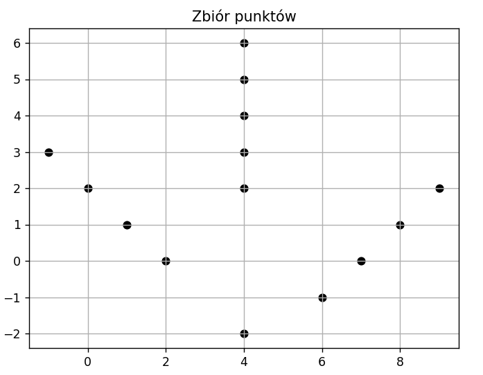

# Projekt zaliczeniowy 
# Wyznaczanie pary najdalszych punktów
## Spis treści 
1. [Opis problemu](#opis-problemu)
2. [Zawartość plików](#zawartość-plików)
3. [Uruchamianie](#uruchamianie)
4. [Pomocna literatura](#pomocna-literatura)
### Opis problemu
Mając dany zbiór punktów na płaszczyźnie 2D należy znaleźć parę punktów najdalej od siebie oddalonych.
Pierwszym i zarazem najprostszym, ale nieoptymalnym sposobem (złożoność czasowa O($n^2$)) jest policzenie odległości miedzy wszystkimi parami punktów.

Lepszym (złożoność czasowa O($nlogn$)) sposobem jest wyznaczenie na początku otoczki wypukłej (convex hull) a następnie użycie metody rotating calipers.

Otoczka wypukła to nic innego jak najmniejszy wielokąt wypukły, który zawiera wszytkie punkty. Poniżej znajduje się przykładowy convex hull.

Do wyznaczenia otoczki wypukłej mozna zastosować wiele algorytmów takich jak np. Gift wrapping, Quickhull czy Monotone chain.
###  Graham scan 
W moim przypadku użyłem algorytmu Graham scan w którym:
1. Na początku znajduję punkt `min_point` o najmniejszych współrzędnych x i y (złożoność czasowa tej operacji to O($n$)).
2. Następnie zaczynam sortować te punkty względem punktu `min_point`(sotruję punkty ze wzgledu na kąt (rosnąco) jaki tworzą razem z `min_point` oraz osia x) używając do tego iloczynu wektorowego oraz sortowania poprzez kopcowanie (złożoność czasowa tej operacji to O($nlogn$)).
3. Potem zaczyam wyznaczać punkty, które utworza naszą otoczkę. Wykorzystuję do tego ponownie iloczyn wektorowy, który pomaga określic "orietnację punktów" czy punkty są ułożone zgodnie z ruchem wskazówek zagara czy też nie i na tej podstawie odrzucam punkty, które powinny zostać pominięte. (złożoność czasowa tej operacji to O($n$)).

### Rotating calipers
Gdy uzyskam już punkty, które utworzą nam otoczke wypukłą, następnie używam algorytmu rotating calipers, w którym:
1. Znajuduję punkt `max_point` o największych współrzędnych x i y  (złożoność czasowa tej operacji to O($n$)).
2. Potem zaczynam sprawdzać kąty, który utworzą nasze "zaciski" i od razu wyliczam dystans pomiędzy punktami przeciwległymi, które mogą być potencjalną parą najdalszych punktów (złożoność czasowa tej operacji to O($n$)).

### Zawartość plików
`main.py` - testy na przykałdowych punktach.  
`read_file.py`  -  funkcja służąca do odczytwania punktów z pliku txt.  
`comapre.py` - funkcja porównująca kąt jaki tworzą punkty z osią x  
`points.py` - klasa reprezentująca punkt  
`heap.py` - funkcje budujące kopiec i sortujące (heapsort)  
`convex_hull.py` - funkcja wyznaczająca punkty, które tworzą otoczkę wypukłą  
`rotating_calipers.py` - funkcja wyzaczająca maksymalna odległość pomiędzy punktami.  
`Data` - folder w którym znajdują się przykładowe punkty zapisane w plikach .txt  
#### Przykładowe zbiory punktów:
`points_1.txt`: 

  
`points_2.txt`: 

  
`points_3.txt`: 

### Uruchamianie
Wystarczy uruchomić `main.py` (skorzystałem z moduły pytest do testowania).
Jeżeli chcemy przetestować działanie algorytmu na własnych punktach należy przygotowawć zwykły plik .txt (lub uzyć jednego z 5, które znajdują się w folderze Data i podmienić zawartość) i zapisać punkty w formacie `a b` gdzie `a` to wartość x punktu, a `b` to wartość y punktu. Liczby oddzielone są znakiem "spacji" czyli np.  
5 5  
-3 2  
Co oznacza że mamy dwa punkty (5, 5) oraz (-3, 2).

### Pomocna literatura
https://www.cs.kent.edu/~dragan/CG/CG-Book.pdf - Opis (dłuższy) algorytmu Graham scan, szukanie srednicy convex hull (czyli szukanie pary najdalszych punktów) oraz wiele więcej informacjii odnośnie geometrii obliczeniowej.  
https://en.wikipedia.org/wiki/Rotating_calipers - Opis (krótszy) odnośnie alogrytmu rotating calipers.  
https://en.wikipedia.org/wiki/Graham_scan - Opis (krótszy) algorytmu Graham scan.  
https://delibra.bg.polsl.pl/Content/64514/BCPS-73378_1994_Algorytm-wyznaczania.pdf - Proces (po polsku) wyznaczania otoczki wypukłej i pary najdalszych punktów.
